# OpenCV Image Processing and Matrix Calculations

## Graduate Computer Vision Assignment

This project uses image-processing operations - Python, OpenCV, NumPy, Pandas, and Matplotlib. I used the same iPhone image throughout the assignment. The project includes image preparation, OpenCV image-processing operations, manual matrix calculations, and numerical verification of the manual results.

---

## Repository Structure

- input/ — original personally captured photograph
- csv/ — numerical matrices and metadata from image preparation
- images/ — prepared square crop and final 200 × 200 image
- outputs/ — OpenCV-generated images and numerical matrices
- manual/ — manual calculation inputs, outputs, comparison matrices, difference matrices, kernels, and verification results
- prepare_image.py — image preparation and metadata generation
- opencv_operations.py — required OpenCV image-processing operations
- manual_calculations.py — independent manual matrix calculations
- verify_matrices.py — comparison of manual and OpenCV matrices
- requirements.txt — Python package requirements

---

# Part A — Image Preparation

### Original Photograph


The original image was loaded using OpenCV.

Original image dimensions:

- Width: 818 pixels
- Height: 1101 pixels
- Channels: 3
- Data type: uint8

Because the original photograph was rectangular, I first center-cropped it to a square before resizing it. This prevented the image from being stretched or distorted when it was resized to 200 × 200 pixels.

## Square Crop


The square crop preserved the center portion of the original photograph while removing the excess height.

## Final 200 × 200 Image


The square image was resized to exactly 200 × 200 pixels for the remaining parts of the assignment.

Final image dimensions:

- Width: 200 pixels
- Height: 200 pixels
- Channels: 3
- Shape: (200, 200, 3)
- Data type: uint8

The same final 200 × 200 image was used throughout the OpenCV processing operations.

---

## Image Metadata

The final 200 × 200 image had the following numerical properties:

- Minimum pixel value: 0
- Maximum pixel value: 255
- Mean pixel value: approximately 118.07
- Standard deviation: approximately 64.27

The numerical image matrices and metadata are stored in the csv/ folder.

---

## BGR and RGB Channel Ordering

OpenCV loads color images using BGR channel ordering rather than RGB ordering.

BGR stores the channels in this order:

Blue → Green → Red

RGB stores the channels in this order:

Red → Green → Blue

This distinction is important when displaying an OpenCV image using a library such as Matplotlib. OpenCV reads the image in BGR order, while Matplotlib normally expects RGB order. If the channels are not converted before displaying the image with Matplotlib, the red and blue colors will appear reversed.

For this assignment, the blue, green, and red channels were separated from the OpenCV BGR image. The three channels were also merged back together in BGR order to reconstruct the color image.
# Part B — OpenCV Image Processing

I performed the required image-processing operations using OpenCV. The operations use 200 × 200 image or 200 × 200 grayscale version. The numerical matrices are stored as CSV files in the outputs/ folder along with the corresponding processed images.

## Color and Intensity Operations

### Grayscale

Purpose: Convert the color image to a single intensity channel.

OpenCV function: cv2.cvtColor  
Parameters: cv2.COLOR_BGR2GRAY  
Output dimensions: 200 × 200

The grayscale image removes the color information while preserving the overall intensity differences and image structure.

### Blue, Green, and Red Channels

Purpose: Separate the individual color channels of the image.

OpenCV method: BGR channel indexing  
Parameters: Blue = channel 0, Green = channel 1, Red = channel 2  
Output dimensions: 200 × 200 for each channel

OpenCV stores the image in BGR order. Separating the channels makes it possible to examine the contribution of each color component individually.

### BGR Reconstruction

Purpose: Reconstruct the color image from the separated blue, green, and red channels.

OpenCV function: cv2.merge  
Parameters: Blue, Green, and Red channels  
Output dimensions: 200 × 200 × 3

Merging the three channels in BGR order reconstructs the original color representation.

### Negative

Purpose: Invert the image intensities.

OpenCV function: cv2.bitwise_not  
Output dimensions: 200 × 200

The negative transformation reverses the intensity values so that bright areas become dark and dark areas become bright.

### Brightness Increase

Purpose: Increase the brightness of the image.

OpenCV function: cv2.add  
Parameter: +40 intensity units  
Output dimensions: 200 × 200

Adding 40 increases the grayscale intensity values. Values that would exceed the maximum 8-bit value are limited to 255.

### Contrast Increase

Purpose: Increase the difference between intensity values.

OpenCV function: cv2.convertScaleAbs  
Parameters: alpha = 1.25, beta = 0  
Output dimensions: 200 × 200

Multiplying the intensity values by 1.25 increases contrast. Larger intensity differences become more noticeable while the output remains within the 8-bit range.

### Binary Threshold

Purpose: Convert the grayscale image to a binary image.

OpenCV function: cv2.threshold  
Parameters: threshold = 127, maximum value = 255  
Output dimensions: 200 × 200

Pixels above the threshold are assigned 255 and pixels at or below the threshold are assigned 0. The resulting image therefore contains only black and white pixels.

### Histogram Equalization

Purpose: Improve grayscale contrast by redistributing intensity values.

OpenCV function: cv2.equalizeHist  
Output dimensions: 200 × 200

Histogram equalization changes the intensity distribution and increases contrast in portions of the image where intensity values were concentrated within a smaller range.

The original and equalized histograms are stored in outputs/color_intensity/histograms/.

---

## Geometric Operations

### Center Crop

Purpose: Extract the center portion of the image.

Method: NumPy array slicing  
Parameters: 100 × 100 center region  
Output dimensions: 100 × 100

The crop retains only the center region of the original 200 × 200 image.

### Horizontal Flip

Purpose: Reverse the image from left to right.

OpenCV function: cv2.flip  
Parameter: flipCode = 1  
Output dimensions: 200 × 200

The horizontal flip reverses the left and right positions of the image pixels.

### Vertical Flip

Purpose: Reverse the image from top to bottom.

OpenCV function: cv2.flip  
Parameter: flipCode = 0  
Output dimensions: 200 × 200

The vertical flip reverses the top and bottom positions of the image pixels.

### 90° Clockwise Rotation

Purpose: Rotate the image 90 degrees clockwise.

OpenCV function: cv2.rotate  
Parameter: cv2.ROTATE_90_CLOCKWISE  
Output dimensions: 200 × 200

Because the input image is square, rotating it 90 degrees changes its orientation without changing its dimensions.

### 30° Counterclockwise Rotation

Purpose: Rotate the image about its center.

OpenCV functions: cv2.getRotationMatrix2D and cv2.warpAffine  
Parameters: angle = 30°, scale = 1.0  
Output dimensions: 200 × 200

A rotation matrix was created around the center of the image and applied using an affine transformation. The output canvas remains 200 × 200.

### Resize to 100 × 100

Purpose: Reduce the spatial resolution of the image.

OpenCV function: cv2.resize  
Parameters: size = 100 × 100, interpolation = cv2.INTER_AREA  
Output dimensions: 100 × 100

Reducing the image dimensions decreases the number of pixels available to represent image detail.

### Nearest-Neighbor Interpolation

Purpose: Resize the 100 × 100 image back to 200 × 200 using nearest-neighbor interpolation.

OpenCV function: cv2.resize  
Parameter: interpolation = cv2.INTER_NEAREST  
Output dimensions: 200 × 200

Nearest-neighbor interpolation copies the value of the nearest source pixel. The enlarged image therefore has more visible pixel boundaries and appears more blocky.

### Bilinear Interpolation

Purpose: Resize the 100 × 100 image back to 200 × 200 using bilinear interpolation.

OpenCV function: cv2.resize  
Parameter: interpolation = cv2.INTER_LINEAR  
Output dimensions: 200 × 200

Bilinear interpolation estimates new values using neighboring pixels, producing a smoother result than nearest-neighbor interpolation.

---

## Spatial Filtering

### Mean Filter

Purpose: Smooth local intensity variations.

OpenCV function: cv2.blur  
Parameter: 3 × 3 kernel  
Output dimensions: 200 × 200

The mean filter replaces each pixel with an average of its neighborhood. This reduces local intensity variation but also softens image details.

### Gaussian Filter

Purpose: Smooth the image using a weighted neighborhood.

OpenCV function: cv2.GaussianBlur  
Parameter: 3 × 3 Gaussian kernel  
Output dimensions: 200 × 200

Unlike the mean filter, the Gaussian filter gives greater weight to pixels near the center of the neighborhood. The result is a smoother image with less uniform averaging.

The 3 × 3 Gaussian kernel used for the manual calculation was:

1 &nbsp;&nbsp; 2 &nbsp;&nbsp; 1  
2 &nbsp;&nbsp; 4 &nbsp;&nbsp; 2  
1 &nbsp;&nbsp; 2 &nbsp;&nbsp; 1  

with a scale factor of 1/16.

### Median Filter

Purpose: Smooth the image using the median neighborhood intensity.

OpenCV function: cv2.medianBlur  
Parameter: kernel size = 3  
Output dimensions: 200 × 200

The median filter replaces each pixel with the median of its neighborhood. It reduces isolated intensity variations while preserving edges better than simple averaging in many regions.

---

## Edge Detection

### Sobel X

Purpose: Measure intensity changes in the x direction.

OpenCV function: cv2.Sobel  
Parameters: dx = 1, dy = 0, kernel size = 3  
Output dimensions: 200 × 200

Sobel X responds strongly to horizontal changes in intensity and therefore emphasizes vertical edge structures.

### Sobel Y

Purpose: Measure intensity changes in the y direction.

OpenCV function: cv2.Sobel  
Parameters: dx = 0, dy = 1, kernel size = 3  
Output dimensions: 200 × 200

Sobel Y responds strongly to vertical changes in intensity and therefore emphasizes horizontal edge structures.

### Gradient Magnitude

Purpose: Combine the Sobel X and Sobel Y responses into an overall measure of edge strength.

Calculation: √(Gx² + Gy²)  
Output dimensions: 200 × 200

The gradient magnitude represents edge strength regardless of whether the intensity change occurs primarily in the x or y direction.

### Laplacian

Purpose: Detect rapid changes in image intensity.

OpenCV function: cv2.Laplacian  
Output dimensions: 200 × 200

The Laplacian responds to intensity changes in multiple directions and highlights regions where the image intensity changes rapidly.

### Canny Edge Detection

Purpose: Produce a binary map of prominent edges.

OpenCV function: cv2.Canny  
Parameters: lower threshold = 100, upper threshold = 200  
Output dimensions: 200 × 200

Canny edge detection produces a more selective edge representation by using the two threshold values to determine which edge responses are retained.

Sobel and Laplacian calculations were retained using signed or floating-point data so that negative gradient responses were not lost.

---

## Morphological Processing

The morphological operations were performed on the binary threshold image using a 3 × 3 kernel of ones.

### Erosion

Purpose: Shrink white foreground regions.

OpenCV function: cv2.erode  
Parameters: 3 × 3 kernel, 1 iteration  
Output dimensions: 200 × 200

Erosion removes foreground pixels along region boundaries, causing the white regions to become smaller.

### Dilation

Purpose: Expand white foreground regions.

OpenCV function: cv2.dilate  
Parameters: 3 × 3 kernel, 1 iteration  
Output dimensions: 200 × 200

Dilation adds foreground pixels along region boundaries, causing the white regions to become larger.

### Opening

Purpose: Perform erosion followed by dilation.

OpenCV function: cv2.morphologyEx  
Parameters: cv2.MORPH_OPEN, 3 × 3 kernel  
Output dimensions: 200 × 200

Opening can remove small foreground features while preserving larger foreground regions.

### Closing

Purpose: Perform dilation followed by erosion.

OpenCV function: cv2.morphologyEx  
Parameters: cv2.MORPH_CLOSE, 3 × 3 kernel  
Output dimensions: 200 × 200

Closing can reduce small gaps or holes within foreground regions.

---

## Contour Analysis

Contours were detected from the binary image using OpenCV. The program generated a binary contour mask, an image showing all detected contours, an image showing the largest contour, and a CSV file containing contour measurements.

A total of **99 contours** were detected.

For the largest contour:

- Area: 9268.5
- Perimeter: 480.98
- Bounding box x-coordinate: 62
- Bounding box y-coordinate: 96
- Bounding box width: 138
- Bounding box height: 104
- Centroid x-coordinate: approximately 143.95
- Centroid y-coordinate: approximately 159.44
---
---

## Processed Image Results

The following images show the visual results of the OpenCV operations described above. All processing was performed using the same prepared image.

### Color and Intensity Results

| Grayscale | Blue Channel | Green Channel |
|:---:|:---:|:---:|
|  |  |  |

| Red Channel | BGR Reconstruction | Negative |
|:---:|:---:|:---:|
|  |  | 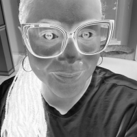 |

| Brightness +40 | Contrast ×1.25 | Binary Threshold |
|:---:|:---:|:---:|
|  |  | 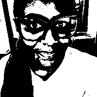 |

#### Histogram Equalization

| Original/Grayscale | Equalized |
|:---:|:---:|
|  |  |

| Original Histogram | Equalized Histogram |
|:---:|:---:|
| 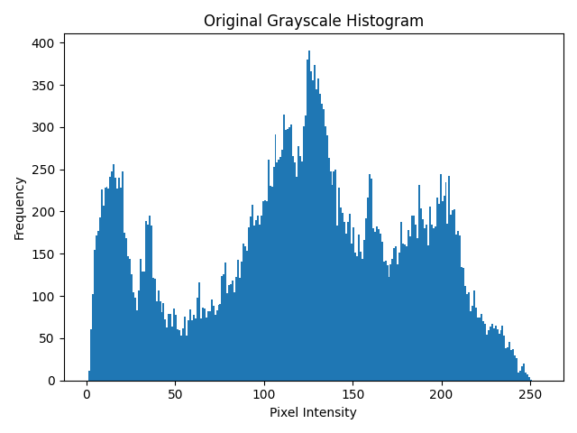 | 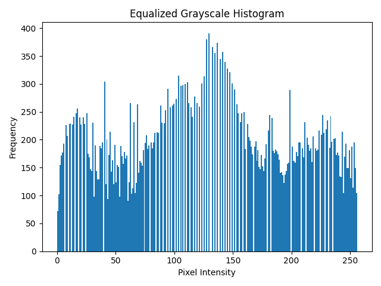 |

---

### Geometric Results

| Center Crop | Horizontal Flip | Vertical Flip |
|:---:|:---:|:---:|
|  |  |  |

| 90° Clockwise Rotation | 30° Counterclockwise Rotation | Resize to 100 × 100 |
|:---:|:---:|:---:|
|  |  |  |

#### Interpolation Comparison

| Nearest Neighbor | Bilinear |
|:---:|:---:|
|  |  |

The nearest-neighbor result shows more distinct pixel boundaries, while bilinear interpolation produces smoother transitions between neighboring pixel values.

---

### Spatial Filtering Results

| Mean Filter | Gaussian Filter | Median Filter |
|:---:|:---:|:---:|
|  |  |  |

The three filters smooth the grayscale image differently. The mean filter averages neighboring values, the Gaussian filter applies weighted smoothing, and the median filter replaces each pixel with the median value of its neighborhood.

---

### Edge Detection Results

| Sobel X | Sobel Y | Gradient Magnitude |
|:---:|:---:|:---:|
| 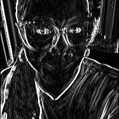 |  |  |

| Laplacian | Canny |
|:---:|:---:|
| 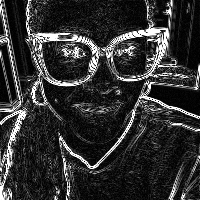 | 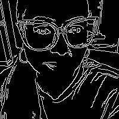 |

Sobel X and Sobel Y emphasize intensity changes in different directions. Gradient magnitude combines the two Sobel responses. Laplacian responds to rapid intensity changes, while Canny produces a binary representation of prominent edges.

---

### Morphological Results

| Erosion | Dilation |
|:---:|:---:|
| 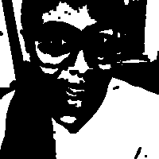 | 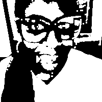 |

| Opening | Closing |
|:---:|:---:|
| 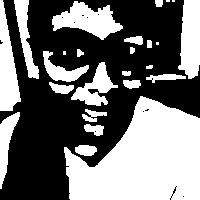 | 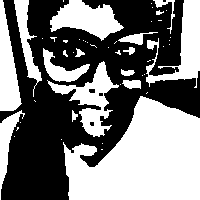 |

Erosion reduces white foreground regions, while dilation expands them. Opening performs erosion followed by dilation, and closing performs dilation followed by erosion.

---

### Contour Results

| Contour Mask | All Detected Contours | Largest Contour |
|:---:|:---:|:---:|
| 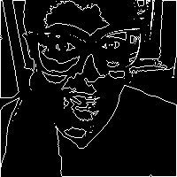 | 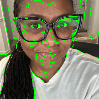 | 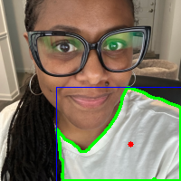 |

The contour results show the binary mask used for contour detection, all detected contour boundaries, and the largest detected contour.
# Part C — Manual Matrix Calculations

## Selected 7 × 7 Grayscale Patch

For the manual matrix calculations, I selected a 7 × 7 grayscale patch containing a wide range of intensity values.

Patch location:

- Rows 115–121
- Columns 15–21

The selected patch was:

```text
236  242  231  236  232   63   37
239  239  227  236  194   50   43
238  225  227  234  100   51   26
231  225  233  198   46   38   48
243  228  238  138   32   26   31
219  226  206   62   35   36   31
222  214  162   36   22   65   33
```

Patch statistics:

- Minimum value: 22
- Maximum value: 243
- Range: 221
- Standard deviation: approximately 90.94

The fixed patch is stored in manual/manual_input_patch_7x7.csv.

---

## Five Grayscale Pixel Calculations

Five pixels from different locations in the 200 × 200 color image were selected for manual grayscale verification.

The grayscale formula used was:

```text
Y = 0.299R + 0.587G + 0.114B
```

The selected pixels were:

| Row | Column | B | G | R | Manual Gray | OpenCV Gray | Difference |
|---:|---:|---:|---:|---:|---:|---:|---:|
| 25 | 25 | 135 | 156 | 166 | 157 | 157 | 0 |
| 50 | 150 | 110 | 128 | 122 | 124 | 124 | 0 |
| 100 | 100 | 97 | 120 | 180 | 135 | 135 | 0 |
| 150 | 50 | 3 | 3 | 3 | 3 | 3 | 0 |
| 175 | 175 | 215 | 216 | 211 | 214 | 214 | 0 |

All five manually calculated grayscale values matched the OpenCV values.

---

## Manual Operations

The following operations were calculated manually and then compared with OpenCV:

1. Grayscale pixel calculations
2. Negative transformation
3. Brightness +40
4. Contrast ×1.25
5. Binary threshold at 127
6. Horizontal flip
7. 3 × 3 mean filter
8. 3 × 3 Gaussian filter
9. 3 × 3 median filter
10. Sobel Gx
11. Sobel Gy
12. Gradient magnitude
13. Erosion
14. Dilation

For each operation, the manual/ folder contains the input matrix, manual output, OpenCV output, and signed difference matrix.

---

# Manual Calculation Examples

The manual calculations were completed using the selected 7 × 7 grayscale patch. For operations that use a 3 × 3 neighborhood, the examples below show how representative output values were calculated.

## Example 1 — 3 × 3 Mean Filter

For the first output cell, I used the upper-left 3 × 3 region of the selected patch:

```text
236  242  231
239  239  227
238  225  227
```

The mean was calculated by adding the nine pixel values and dividing by 9:

```text
(236 + 242 + 231 + 239 + 239 + 227 + 238 + 225 + 227) / 9

= 2104 / 9

= 233.777...

≈ 234
```

The manual result was 234. OpenCV produced the same value, so the difference was 0.

---

## Example 2 — 3 × 3 Gaussian Filter

The Gaussian kernel was:

```text
1  2  1
2  4  2
1  2  1
```

with a scale factor of 1/16.

Using the same 3 × 3 neighborhood:

```text
236  242  231
239  239  227
238  225  227
```

I multiplied each pixel by the corresponding kernel value:

```text
1(236) + 2(242) + 1(231)
+ 2(239) + 4(239) + 2(227)
+ 1(238) + 2(225) + 1(227)

= 236 + 484 + 231
  + 478 + 956 + 454
  + 238 + 450 + 227

= 3754
```

Then I applied the scale factor:

```text
3754 / 16 = 234.625
```

After rounding, the manual result was 235. OpenCV also produced 235 for this location.

Across the complete 5 × 5 Gaussian output, 24 of the 25 values matched exactly. One value differed by 1 because of rounding.

---

## Example 3 — 3 × 3 Median Filter

Using the same neighborhood:

```text
236  242  231
239  239  227
238  225  227
```

The nine pixel values were:

```text
236, 242, 231, 239, 239, 227, 238, 225, 227
```

After sorting:

```text
225, 227, 227, 231, 236, 238, 239, 239, 242
```

Since there are nine values, the median is the fifth value:

```text
Median = 236
```

The manual result was 236, and OpenCV also produced 236.

---

## Example 4 — Sobel Gx

The Sobel Gx kernel was:

```text
-1   0   1
-2   0   2
-1   0   1
```

Using the first 3 × 3 neighborhood:

```text
236  242  231
239  239  227
238  225  227
```

the calculation was:

```text
(-1)(236) + (0)(242) + (1)(231)
+ (-2)(239) + (0)(239) + (2)(227)
+ (-1)(238) + (0)(225) + (1)(227)

= -236 + 231 - 478 + 454 - 238 + 227

= -40
```

The manual Sobel Gx result was -40. The OpenCV result was also -40.

The negative value was preserved because the sign represents the direction of the intensity change.

---

## Example 5 — Sobel Gy

The Sobel Gy kernel was:

```text
-1  -2  -1
 0   0   0
 1   2   1
```

Using the same neighborhood:

```text
236  242  231
239  239  227
238  225  227
```

the calculation was:

```text
(-1)(236) + (-2)(242) + (-1)(231)
+ (0)(239) + (0)(239) + (0)(227)
+ (1)(238) + (2)(225) + (1)(227)

= -236 - 484 - 231 + 238 + 450 + 227

= -36
```

The manual Sobel Gy result was -36. OpenCV also produced -36.

---

## Example 6 — Gradient Magnitude

For the first output cell:

```text
Gx = -40
Gy = -36
```

The gradient magnitude was calculated as:

```text
G = sqrt(Gx^2 + Gy^2)

G = sqrt((-40)^2 + (-36)^2)

G = sqrt(1600 + 1296)

G = sqrt(2896)

G ≈ 53.814
```

The manual gradient magnitude was approximately 53.814. The OpenCV-based result was also approximately 53.814.

---
# Additional Representative Neighborhood Calculations

The 7 × 7 input patch produces a 5 × 5 valid output for operations that use a 3 × 3 neighborhood. Three representative output locations were checked for each neighborhood-based operation: the first output cell, the center output cell, and the last output cell.

## Mean Filter — Three Representative Cells

### Output cell (0,0)

Neighborhood:

```text
236  242  231
239  239  227
238  225  227
```

Calculation:

```text
(236 + 242 + 231 + 239 + 239 + 227 + 238 + 225 + 227) / 9
= 2104 / 9
= 233.777...
≈ 234
```

Manual result: 234

### Output cell (2,2)

Neighborhood:

```text
227  234  100
233  198   46
238  138   32
```

Calculation:

```text
(227 + 234 + 100 + 233 + 198 + 46 + 238 + 138 + 32) / 9
= 1446 / 9
= 160.666...
≈ 161
```

Manual result: 161

### Output cell (4,4)

Neighborhood:

```text
32  26  31
35  36  31
22  65  33
```

Calculation:

```text
(32 + 26 + 31 + 35 + 36 + 31 + 22 + 65 + 33) / 9
= 311 / 9
= 34.555...
≈ 35
```

Manual result: 35

---

## Gaussian Filter — Three Representative Cells

Kernel:

```text
1  2  1
2  4  2
1  2  1
```

Scale factor: 1/16

### Output cell (0,0)

```text
1(236) + 2(242) + 1(231)
+ 2(239) + 4(239) + 2(227)
+ 1(238) + 2(225) + 1(227)

= 3754

3754 / 16 = 234.625
≈ 235
```

Manual result: 235

### Output cell (2,2)

```text
1(227) + 2(234) + 1(100)
+ 2(233) + 4(198) + 2(46)
+ 1(238) + 2(138) + 1(32)

= 2691

2691 / 16 = 168.1875
≈ 168
```

Manual result: 168

### Output cell (4,4)

```text
1(32) + 2(26) + 1(31)
+ 2(35) + 4(36) + 2(31)
+ 1(22) + 2(65) + 1(33)

= 576

576 / 16 = 36
```

Manual result: 36

---

## Median Filter — Three Representative Cells

### Output cell (0,0)

Sorted neighborhood values:

```text
225, 227, 227, 231, 236, 238, 239, 239, 242
```

The fifth value is:

```text
236
```

Manual result: 236

### Output cell (2,2)

Sorted neighborhood values:

```text
32, 46, 100, 138, 198, 227, 233, 234, 238
```

The fifth value is:

```text
198
```

Manual result: 198

### Output cell (4,4)

Sorted neighborhood values:

```text
22, 26, 31, 31, 32, 33, 35, 36, 65
```

The fifth value is:

```text
32
```

Manual result: 32

---

## Sobel Gx — Three Representative Cells

Kernel:

-1 &nbsp;&nbsp; 0 &nbsp;&nbsp; 1  
-2 &nbsp;&nbsp; 0 &nbsp;&nbsp; 2  
-1 &nbsp;&nbsp; 0 &nbsp;&nbsp; 1  

### Output cell (0,0)

(-1)(236) + (0)(242) + (1)(231)  
+ (-2)(239) + (0)(239) + (2)(227)  
+ (-1)(238) + (0)(225) + (1)(227)  

= -40

Manual result: **-40**

### Output cell (2,2)

(-1)(227) + (0)(234) + (1)(100)  
+ (-2)(233) + (0)(198) + (2)(46)  
+ (-1)(238) + (0)(138) + (1)(32)  

= -707

Manual result: **-707**

### Output cell (4,4)

(-1)(32) + (0)(26) + (1)(31)  
+ (-2)(35) + (0)(36) + (2)(31)  
+ (-1)(22) + (0)(65) + (1)(33)  

= 2

Manual result: **2**

---

## Sobel Gy — Three Representative Cells

Kernel:

-1 &nbsp;&nbsp; -2 &nbsp;&nbsp; -1  
0 &nbsp;&nbsp;&nbsp;&nbsp; 0 &nbsp;&nbsp;&nbsp;&nbsp; 0  
1 &nbsp;&nbsp;&nbsp;&nbsp; 2 &nbsp;&nbsp;&nbsp;&nbsp; 1  

### Output cell (0,0)

(-1)(236) + (-2)(242) + (-1)(231)  
+ (0)(239) + (0)(239) + (0)(227)  
+ (1)(238) + (2)(225) + (1)(227)  

= -36

Manual result: **-36**

### Output cell (2,2)

(-1)(227) + (-2)(234) + (-1)(100)  
+ (0)(233) + (0)(198) + (0)(46)  
+ (1)(238) + (2)(138) + (1)(32)  

= -249

Manual result: **-249**

### Output cell (4,4)

(-1)(32) + (-2)(26) + (-1)(31)  
+ (0)(35) + (0)(36) + (0)(31)  
+ (1)(22) + (2)(65) + (1)(33)  

= 70

Manual result: **70**

---

## Gradient Magnitude — Three Representative Cells

Gradient magnitude was calculated from the manually computed Sobel Gx and Gy values using:

**Gradient magnitude = √(Gx² + Gy²)**

### Output cell (0,0)

Gx = -40  
Gy = -36  

√((-40)² + (-36)²)  
= √2896  
≈ 53.814

Manual result: **53.814**

### Output cell (2,2)

Gx = -707  
Gy = -249  

√((-707)² + (-249)²)  
= √561851  
≈ 749.567

Manual result: **749.567**

### Output cell (4,4)

Gx = 2  
Gy = 70  

√((2)² + (70)²)  
= √4904  
≈ 70.029

Manual result: **70.029**

---

## Erosion — Three Representative Cells

The binary input uses 255 for white foreground pixels and 0 for black background pixels. With a 3 × 3 kernel of ones, erosion produces 255 only when every value in the neighborhood is 255.

### Output cell (0,0)

Neighborhood:

```text
255  255  255
255  255  255
255  255  255
```

All nine values are 255.

```text
Output = 255
```

### Output cell (2,2)

Neighborhood:

255  255    0
255  255    0
255  255    0


The neighborhood contains 0 values.

```text
Output = 0
```

### Output cell (4,4)

Neighborhood:

```text
0  0  0
0  0  0
0  0  0
```

The neighborhood does not contain nine white pixels.

```text
Output = 0
```

---

## Dilation — Three Representative Cells

With the same 3 × 3 kernel, dilation produces 255 when at least one value in the neighborhood is 255.

### Output cell (0,0)

```text
255  255  255
255  255  255
255  255  255
```

At least one white pixel is present.

```text
Output = 255
```

### Output cell (2,2)

```text
255  255    0
255  255    0
255  255    0
```

White pixels are present.

```text
Output = 255
```

### Output cell (4,4)

```text
0  0  0
0  0  0
0  0  0
```

No white pixels are present.

```text
Output = 0
```
# Verification Results

The manual results were compared with the corresponding OpenCV results using:

```text
Difference = OpenCV output - Manual output
```

The verification program checked:

- Matrix dimensions
- Maximum absolute difference
- Mean absolute difference
- Number of exact matching cells
- Percentage of exact matching cells

The results were:

| Operation | Max Difference | Mean Difference | Exact Matches |
|---|---:|---:|---:|
| Grayscale | 0 | 0.00 | 100% |
| Negative | 0 | 0.00 | 100% |
| Brightness +40 | 0 | 0.00 | 100% |
| Contrast ×1.25 | 0 | 0.00 | 100% |
| Threshold | 0 | 0.00 | 100% |
| Horizontal Flip | 0 | 0.00 | 100% |
| Mean Filter | 0 | 0.00 | 100% |
| Gaussian Filter | 1 | 0.04 | 96% |
| Median Filter | 0 | 0.00 | 100% |
| Sobel Gx | 0 | 0.00 | 100% |
| Sobel Gy | 0 | 0.00 | 100% |
| Gradient Magnitude | 0 | 0.00 | 100% |
| Erosion | 0 | 0.00 | 100% |
| Dilation | 0 | 0.00 | 100% |

Thirteen of the fourteen operations matched exactly for every tested value.

For the Gaussian filter, 24 of 25 cells matched exactly. The remaining cell differed by one intensity level. The maximum absolute difference was 1, which is within the allowed tolerance for rounding-based operations.

The complete verification results are stored in manual/verification_summary.csv.

---

# Discussion

## Nearest-Neighbor and Bilinear Interpolation

Nearest-neighbor interpolation assigns each new pixel the value of the closest source pixel. When the reduced image was enlarged back to 200 × 200, the nearest-neighbor result appeared more pixelated and contained sharper transitions between neighboring pixel values.

Bilinear interpolation estimates a new value using neighboring source pixels. The bilinear result appeared smoother than the nearest-neighbor result because the new pixel values were calculated from surrounding pixels rather than copied directly from one source location.

---

## Mean, Gaussian, and Median Filtering

The three filters produced different smoothing effects.

The mean filter replaces a pixel with the average of the values in its neighborhood. This reduces local intensity variation but can also blur edges.

The Gaussian filter uses weighted neighboring values, with the center of the kernel receiving the largest weight. This produced smoothing while giving more importance to pixels near the center of the neighborhood.

The median filter selects the median neighborhood value rather than calculating an average. This makes it less sensitive to isolated extreme values and can preserve edges better than averaging in some situations.

---

## Thresholding

Binary thresholding reduced the grayscale image to two possible values: 0 and 255.

For this assignment, pixels greater than 127 were set to 255, while pixels less than or equal to 127 were set to 0.

The resulting binary image was then used for morphological processing and contour analysis.

---

## Morphological Operations

Erosion and dilation changed the shape of the white foreground regions in the binary image.

Erosion required all pixels within the 3 × 3 neighborhood to be white for the output pixel to remain white. This caused the white regions to shrink.

Dilation required at least one white pixel in the neighborhood for the output pixel to become white. This caused the white regions to expand.

Opening applies erosion followed by dilation and can remove small foreground regions.

Closing applies dilation followed by erosion and can close small gaps within foreground regions.

---

## Edge Detection

The Sobel Gx and Gy operations measured directional intensity changes.

Sobel Gx responds to changes across image columns and emphasizes vertical edge structure. Sobel Gy responds to changes across image rows and emphasizes horizontal edge structure.

The gradient magnitude combines both directional measurements to represent overall edge strength.

The Laplacian measures rapid intensity changes using a second-order derivative, while Canny produces a binary edge map using a multi-stage edge-detection process.

Signed and floating-point values were retained during the Sobel and Laplacian calculations so that negative gradient information was not lost.

---

## Manual Calculations Compared with OpenCV

The manual calculations agreed closely with the OpenCV results.

Thirteen of the fourteen operations matched exactly. The only difference occurred in the Gaussian filter, where one output value differed by one intensity level because of rounding.

Performing the operations manually on a small matrix made it possible to see how each output value was produced from the original pixel values. Comparing those calculations with OpenCV also provided a way to verify that the implementation was working correctly.

---

## Key Observations

This assignment demonstrated that an image can be treated as a numerical matrix and that image-processing operations can be understood as mathematical transformations of those matrix values.

Point operations such as brightness adjustment, contrast adjustment, thresholding, and negative transformation operate directly on individual pixel values. Neighborhood operations such as filtering, Sobel edge detection, erosion, and dilation depend on surrounding pixels.

The assignment also demonstrated the importance of choosing an appropriate data type. Standard images commonly use unsigned 8-bit values between 0 and 255, but gradient calculations can produce negative values or values outside that range. Signed or floating-point representations are therefore necessary during some intermediate calculations.

---

# Requirements

This project was completed using:

- Python 3.13.15
- OpenCV
- NumPy
- Pandas
- Matplotlib
---

# Reproducibility

The programs use relative file paths rather than machine-specific absolute paths. This allows the repository to be cloned and run on another system without manually changing local directory paths.

The workflow is:

1. Run prepare_image.py
2. Run opencv_operations.py
3. Run verify_matrices.py


The generated numerical matrices and images are stored in the appropriate repository folders.

# Execution Sequence

Run the programs from the repository root in this order:

python prepare_image.py
python opencv_operations.py
python manual_calculations.py
python verify_matrices.py
